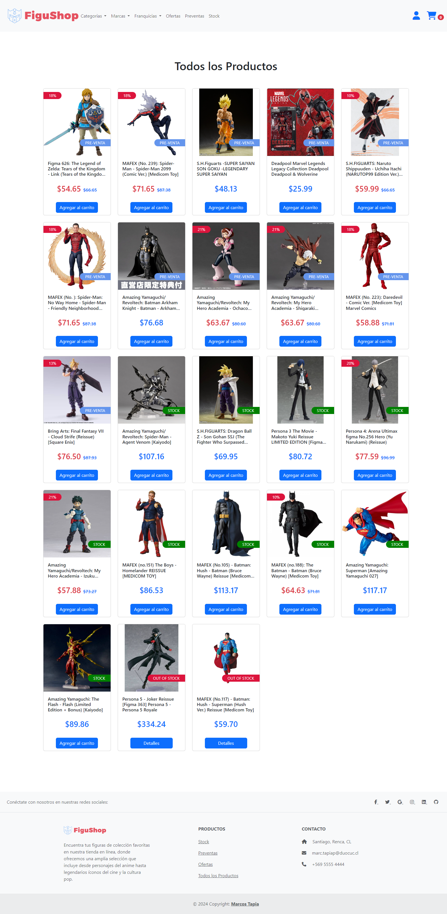
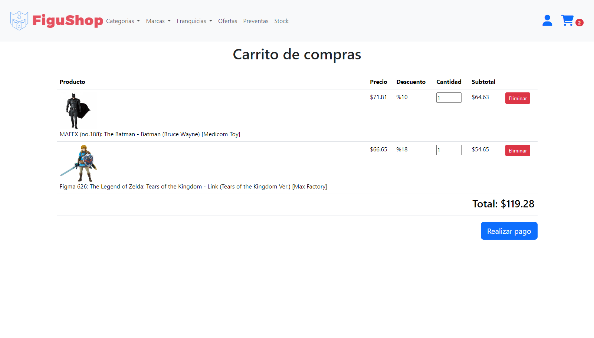
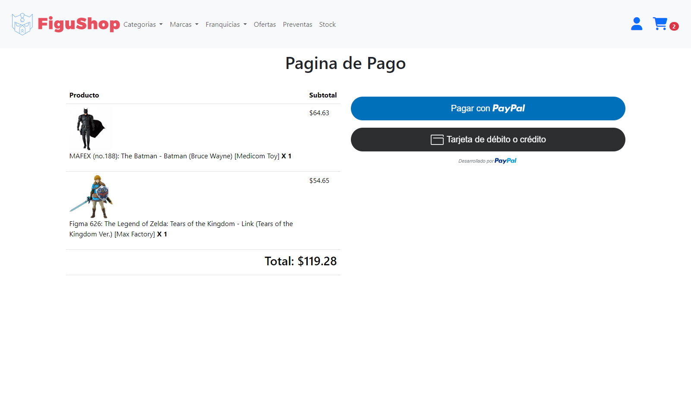
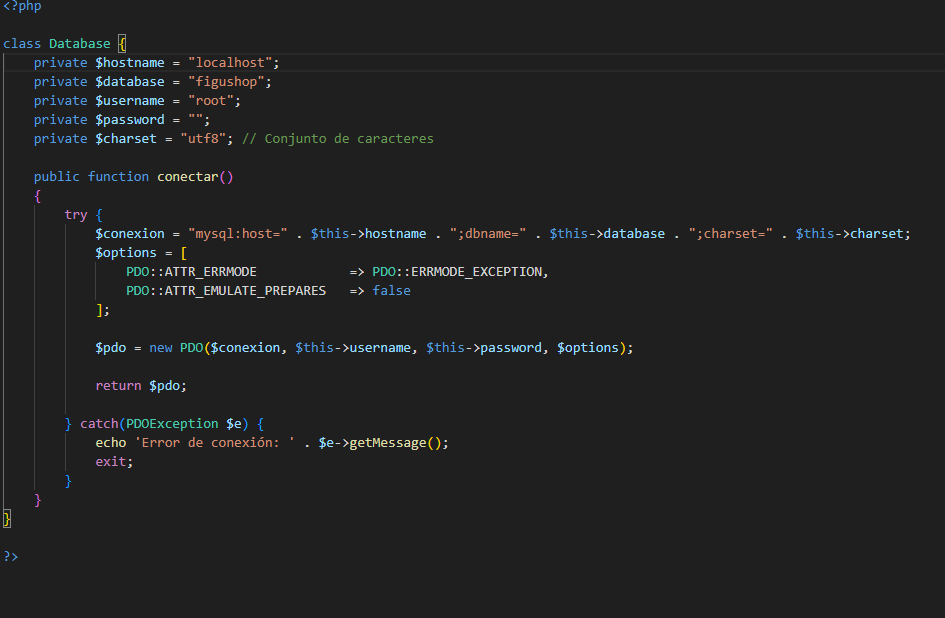

# FiguShop

## Descripción
Este proyecto es una página de ecommerce dedicada a la venta de figuras coleccionables. Desarrollado con una estructura HTML utilizando PHP y JavaScript, con estilos proporcionados por Bootstrap y CSS. También se utiliza jQuery para interacciones dinámicas y una API de PayPal para gestionar los pagos.

## Características Principales
- **Autenticación de Usuarios:** Registro e inicio de sesión seguros.
- **Gestión de Productos:** Creación, lectura, actualización y eliminación (CRUD) de productos utilizando MySQL.
- **Carrito de Compras:** Añadir y eliminar productos del carrito.
- **Procesamiento de Pagos:** Integración con la API de PayPal para realizar pagos.
- **Registro de Compras:** Registro de todas las compras realizadas en la base de datos MySQL.
- **Interfaz Intuitiva:** Diseño responsive y fácil de usar con Bootstrap.

## Capturas de Pantalla
- **Página de Inicio:**

- **Página de Productos:**

- **Carrito de Compras:**

- **Página de Pago:**


## Prerrequisitos
- [XAMPP](https://www.apachefriends.org/index.html) o cualquier otro servidor local con Apache y MySQL.
- [Git](https://git-scm.com/) para clonar el repositorio.

## Instrucciones de Instalación

### 1. Clona el Repositorio
```bash
git clone https://github.com/izak20/FiguShop.git
cd FiguShop
```
### 2. Configura el Servidor Local
Asegúrate de que Apache y MySQL estén corriendo en XAMPP.

### 3. Importa la Base de Datos
- Abre phpMyAdmin y crea una nueva base de datos llamada 'figushop'.
- Selecciona la nueva base de datos y haz clic en la pestaña "Importar".
- Selecciona el archivo database/figushop.sql y haz clic en "Continuar".
  
### 4. Configura la Conexión a la Base de Datos
- Abre el archivo config/database.php.
- Asegúrate de que los parámetros (nombre de la base de datos, usuario, contraseña) sean correctos.
- **Ejemplo db:**


### 5. Configura la API de PayPal
- Abre el archivo "config/config.php" y añade tus credenciales de la API de PayPal (en el client_id y el currency de ser necesario).
- los botones de PayPal se configuran en "pago.php" (script: paypal.buttons).
  
### 6. Mueve el Proyecto a la Carpeta 'htdocs'
- Copia la carpeta del proyecto 'FiguShop' y pégala en 'C:\xampp\htdocs'.
  
### 7. Ejecuta la Aplicación
Abre tu navegador y navega a 'http://localhost/FiguShop'.

## Tecnologías Utilizadas
- PHP
- MySQL
- HTML
- CSS
- Bootstrap
- javaScript
- jQuery
- PayPal API
  
## Contacto
Si tienes alguna pregunta, no dudes en contactarme a través de marcostapiapozo12@gmail.com.
